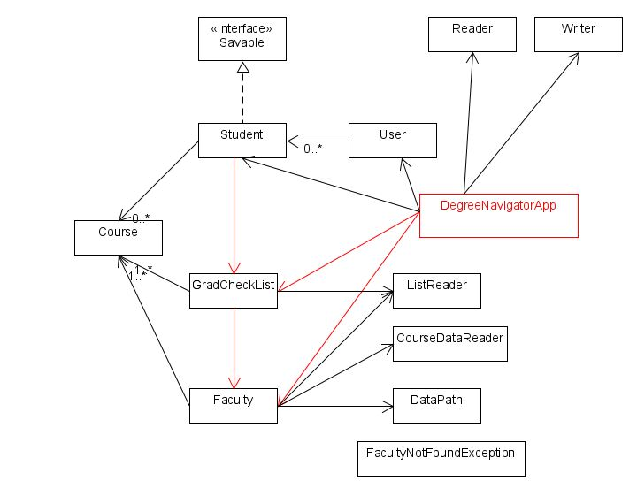
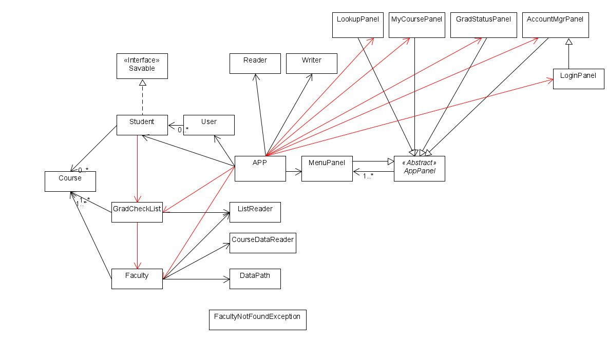

# BCS Degree Navigator

## An application that helps BCS students to navigator through courses and credits.  

Many of us have experienced the back and forth searching and checking on the UBC course website to find the course that answers all the following questions: 
- Is it mandatory for the BCS program?
- Do I have all the pre-requisites to take this course?
    - If not, what am I missing?
- If I take this course, what are the next level courses I can take? 
- How many more credits do I need to graduate?
- I am interested in certain area of computer science, what are the courses that are related to this area? 

Instead of opening up each individual course pages to check for answers, I am building this BCS degree navigator application that includes the following **features**:     

- Course can be searched through course number 
- Add *or* delete courses
- View courses have taken and still need to take 
- Automatic graduation check for BCS program    

Possible future upgrades:
- Course can be searched through keywords
- Course includes all pre-requisites *and* dependents 
- By adding the courses user have taken, app will show weather the user has all pre-reqs for the given courses, as well as what is missing.
- Built-in BCS graduation check list 
- Based on the user's interest, provides recommendation on potential course stream.

Restrictions: 
- Available course data currently limited at courses provided by CPSC, MATH, CPEN, STAT, ENGL departments ONLY
- Pre-reqs for CS courses will included however second degree query on courses offered by non-CS fculties is not available

## phase 1 - user stories 
As a user I want to be able to:
- add the courses I have taken in the app
- view the courses I have taken in the app 
- search for available courses at UBC 
- view the course description for each course
- view how far I am from graduation (what are the remaining courses I need to take to graduate)

If possible I would like to:
- check the pre-req for each course 
- check if I meet all the pre-reqs for this course 
- get a list of the missing pre-reqs I need for this course 

## phase 2 - user stories 

As a user I want to be able to:
   - save the courses I have added to my course list to a file 
   - choose to login to an existing account or start the app as a new user
   - view all the accounts that have been saved in the app (login with different options)
   - delete existing accounts 
   
## phase 3 - instruction for grader 

The GUI is under main-ui-App. Previously saved data is **loaded** automatically when app starts. You are first logged in with a temporary account "anonymous". App starts with its main menu:

- you can look for a course in *look up courses*
   + course can be searched by typing in its id (click *search* or press 'enter' to search) or by choosing from faculty list
   + the selected course can be **added** to current users' course list through "add to my list"
- you can check the courses you have taken in *check my course*
   + *taken courses* **displays** courses you have **added** to your list, you can click on the button to update the list anytime you make a change
   + *to take courses* **displays** the courses you still need to take to fulfill the BCS graduation requirement, you can click on the button to update the list anytime you make a change
   + *mandatory courses* **displays** the courses that are mandatory for all BCS students.
   + you can **add** or **remove** selected course from your list     
- you can check your graduation status in *check my graduation status*
   + if you have not taken all the "to taken courses", it tells how many more courses you still need to take to graduate
   + once you have taken all the "to-take courses", it **triggers an image to display** to congratulate the user
- you can log in or register a new user in *log in*
   + you can register a new user or login as an existing user **(load saved data)**
   + existing users' courses **information are loaded automatically** when the app starts
   + users are stored and identified by their 8-digits student id  
- you can manage existing users in *account manager*
   + you can **delete** existing users
- you can **save** current user data in *save and existing*
   + closing the frame will also give you the option to **save** data
 
 image source: https://www.shutterstock.com/image-vector/you-did-card-banner-beautiful-greeting-617194997
 
 ## phase 4 - Task 2
 
 requirement:  *Make appropriate use of the Map interface somewhere in your code.*  
 
 HashMap is implemented in multiple classes in this app. For example: 
 - In Student: HashMap is being used to store the courses student has taken by storing the course id (String e.g."CPSC110") as key, and  the corresponding actual Course object as value. Chose to use HashMap here allows easy conversion to JSON object when saving and reading the data.
 - In Faculty and GradChecklist: HashMap is being used to store courses with course id (String) as key and the corresponding actual Course object as value. Chose to use HashMap to store the courses here for fast searching.
 - In User, HashMap is being used to store the existing user with student id (String) as key and the corresponding actual Student object as value. Chose to use HashMap here allows easy conversion to JSON object when saving and reading the data.
 

 ## phase 4 - Task 3
- DegreeNavigatorApp is not used 
    + *change*: deleted the unused class
- Too many couplings: GradCheckList does not need an instance of Faculty as a field, it is only accessing a field in Faculty. Student does not need an instance of GradCheckList as a field, it is only accessing the fields in GradCheckList.  
    + *change*: applied Singleton Design Pattern to reduce coupling. (UMLs are shown below)
    
    
- Too many couplings between App and panels  
    + *change*: applied Composite Design Pattern to reduce coupling. (UMLs are shown below)       
- Too many couplings between App, Users, and Student
    + *change*: couplings have been reduced by applying the Singleton Design pattern to GradCheckList and Faculty.  
    
    
 

 